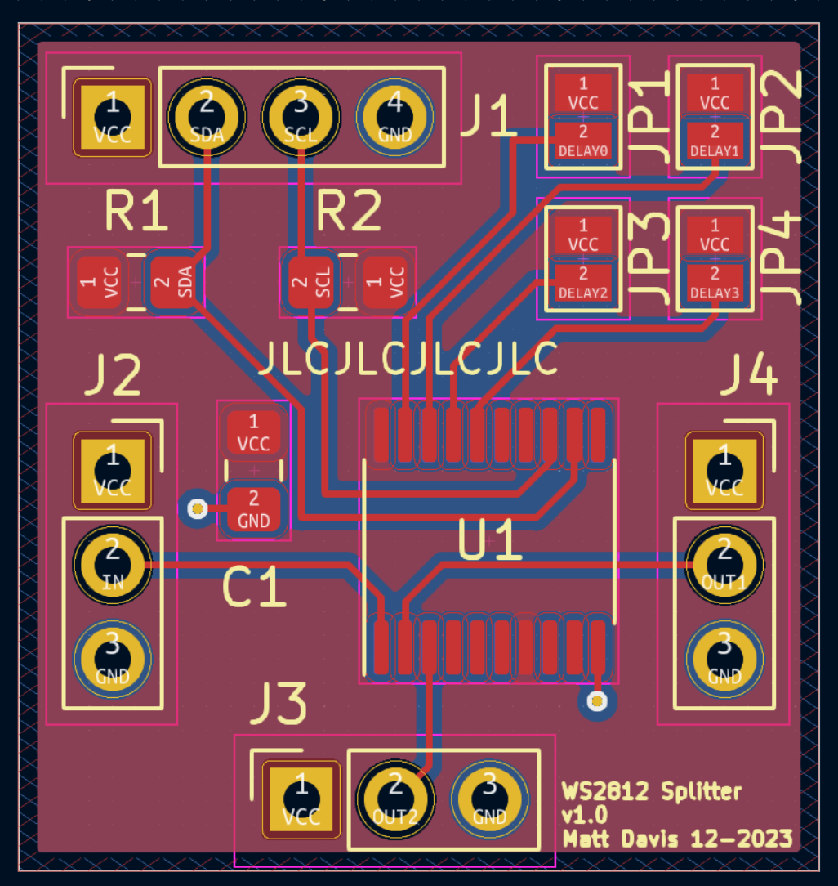

# WS2812 Splitter

> [!WARNING]
> This project is still very much in beta and I am yet to receive the PCBs and fully verify the desgn.

A configurable splitter compatible with WS2812(B) LEDs. Splits the incoming signal two ways; the first is a copy of the input and the second is disabled for N LED's worth of data. This allows you to run two strips in parallel with each other.

The project is based on the work by [Pete on hackaday.io](https://hackaday.io/project/8181-ws2812b-delay-splitter). As far as I can tell Pete never got it working, this is intended to be a continuation of that work.

The project is being used personally for WS2812B Icicles. Rather than running wires from the bottom of each icicle back to the next LED (to create a continuous strip) this project allows you to place a 'tee' at the top of each icicle, that delays the continuing signal by the length of the drop.

This is maybe best viewed as an image

## Hardware

The design uses a Renesas SLG46826 SPLD to implement the logic required to detect the reset period, count LED words and generate the split signal.

A custom PCB was designed using the TSSOP-20 package to ease soldering. On board are 4 solder jumpers that set the length of the drop; between 0 and 15 LEDs.

### Renesas Greenpak Designer

The Renesas Greenpak software is free to download. I used the Ubuntu version successfully on Fedora. Mac and Windows are also available. This is a screenshot of the design I came up with. I went the multi-programmable chips; a little bit more expensive but I wanted to be sure the design worked and could be tweaked.

*Note*: Counters reset to `N` and trigger on 0 so should be set to `N-1`

Break down of macrocells

* Reset Detector
    - WS2812 datasheet states a minimum 50us reset period - data line held low
    - CNT0 is clocked by OSC2 at 25MHz, counting to 1249 (50us)
    - Generates `rst` and `nRst` nets
* Bit Counter
    - Clocked by incoming data on rising edges
    - Reset by the `rst` net
    - Counter set to 23 (24b - 1) generating a per-LED pulse
* Word Counter
    - Uses the built-in 3-bit ripple counter
    - Additionally a DFF is used to add a 4th bit to the counter
    - The counter is reset by `nRst`
* Delay Comparator
    - Compares the output of the ripple counter with the user input
    - The comparisons are ANDed together to generate an *output enable* signal
    - To fix the timing the Word Counter pulse is removed from the *output enable* signal
* Hold
    - The LUT acts as an SR-FlipFlop to hold the output latch High after the first comparison
    - The latch is reset by the `rst` net after >=50us of now input data

The design leaves several blocks unused which could be used to expand to >15 LEDs in future.

### PCB

The PCB is designed using KiCad 7 and manufactured by JLCPCB.

I aimed to keep in compact while still allowing hand soldering. The design uses the TSSOP package for the SLG and 0805 (2012) resistors and capacitors. The input signal is on `J2`, `J3` carries a regenerated signal down the icicle, `J4` carries the signal that is missing the first `N` LEDs worth of data; LEDs after this point will act as though they are at the end of the icicle.

`N` is set using `JP1-4` using binary - the pads can be soldered and desoldered easily.

## Programming

The `J1` header on the PCB is designed as a programming header. It provides power and I2C connectivity to the chip. To program the SLG46826 I used a pogo pin assembly from eBay and a CH341A chip. I'm using [this](https://github.com/Steve-Tech/i2c-ch341-usb) fork of the Linux CH341A I2C module because it supports kernel 6.4+

I wrote a custom SLG programmer to talk I2C over a standard Linux `/dev/i2c-#` device, available [here](https://github.com/mattdavis90/slg_programmer)